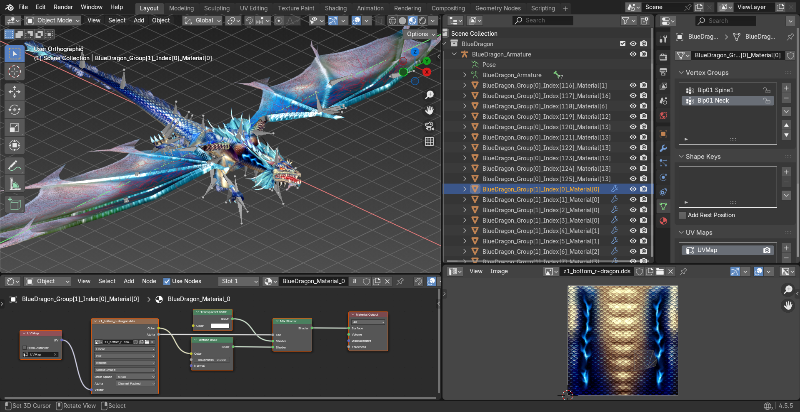
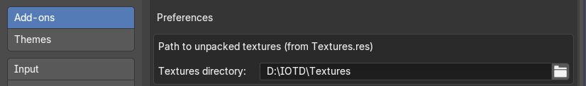
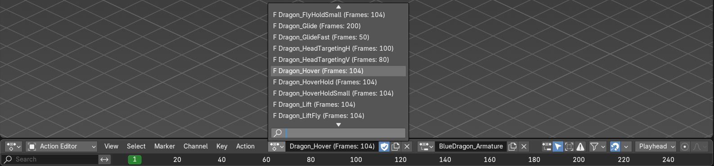
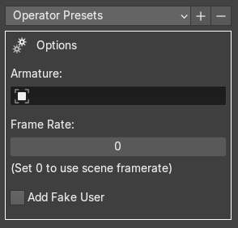

# IDragon Blender Tools #
Blender (3.0+) addon for importing MSH files (mesh) and ANM files (animation), mainly from game <i><b>I of the Dragon</b> (2002)</i> by Primal Software.    

Currently work in progress.    

## Current Status
VERSION: 1.0.0

Supported Features: 
 * Full meshes import (with normals, weights, UVs, etc.)
 * Full bones import
 * Textures import (with material setup)
 * Animations import
 * Big & small mesh transition import for dragons (as shape keys)
 * Bounding planes import
 * Merge meshes (by groups / textures)
 * Drag & drop import (Blender 4.1+ required) and multiple import

## Details

### Installation & Configuration
 1. Download the repository as ZIP, or download the addon from [releases](https://github.com/XenonBaruku/IDragon-Blender-Tools/releases), then install like usual Blender addons.
 2. Config unpacked textures directory in addon preferences.
 
 3. Check <b>File > Import</b>, there should be a new item named <b><i>The I of the Dragon</i></b>, with all supported file types in it.

### MSH Import
<b>Import Settings</b>    

<b>Operator Presets</b>: Apply presets of import settings. Use <b>+</b> or <b>-</b> button to create or delete custom presets.

<b>Create Collections</b>: Create collections for imported meshes, bounding planes, etc.

<b>Merge Mesh Parts</b>: Choose whether merge imported mesh parts or not, and how those mesh parts are merged. 
 * <b>None</b> - Do not merge mesh parts
 * <b>By Groups</b> - Merge mesh parts by group IDs
 * <b>By Textures</b> - Merge mesh parts by textures used
 * <b>All</b> - Merge all imported mesh parts

<b>Import Textures</b>: Whether import textures (and setup materials) or not. Note that textures directory in addon preferences must be set in order to use this.

<b>Texture Interpolation</b>: Interpolation mode for imported textures. Only available when <b>Import Textures</b> is ON.

<b>Import Bounding Planes</b>: Import 2D planes data stored in MSH files that likely to be bounds.

<b>Import Shape Keys (Dragons Only)</b>: Import big & small transitions for dragon models as Blender shape keys. (NOT IMPLEMENTED YET)

### ANM Import

<b>Where to find imported animations?</b>

Check <b>Dope Sheet > Action Editor</b> for all imported animations of active armature.

<b>Import Settings</b>    

<b>Operator Presets</b>: Apply presets of import settings. Use <b>+</b> or <b>-</b> button to create or delete custom presets.

<b>Armature</b>: Blender armature that imported animations attach to.

<b>Frame Rate</b>: Framerate that imported animations based on. Uses scene framerate when set to 0.

<b>Add Fake User</b>: Add fake user to imported animations to keep them while saving .blend files.

## Credits
 * Great thanks to [AlexKimov](https://github.com/AlexKimov) for their research and tools provided at [their repository](https://github.com/AlexKimov/primal-file-formats).
 * The addon was developed with reference to some other addons. Thanks to them and developers of those addons.
